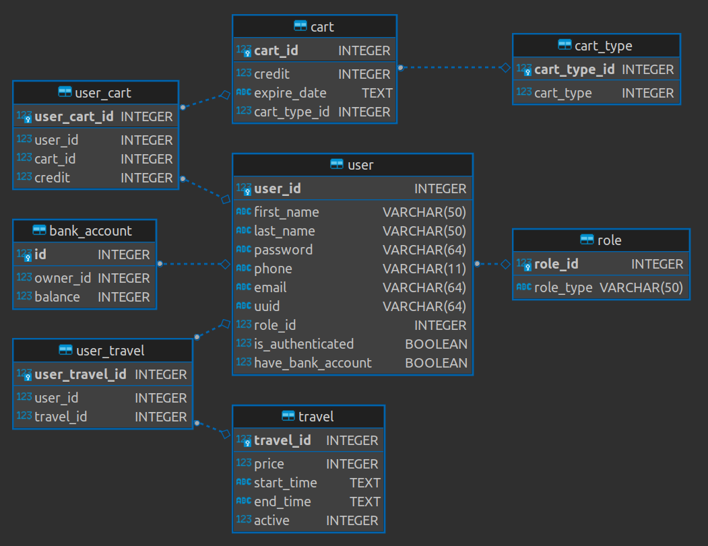

# maktab89_hw12

### run program from `main_.py`

# options:
====== main menu ======
1. register new user
2. manage bank account
3. buy ticket
4. administrator
5. select travel
0. exit

===== bank menu =====
1. withdraw
2. deposit
0. exit

===== admin menu =====
1. submit travel
2. edit travel
3. add cart
0. exit

#database model
